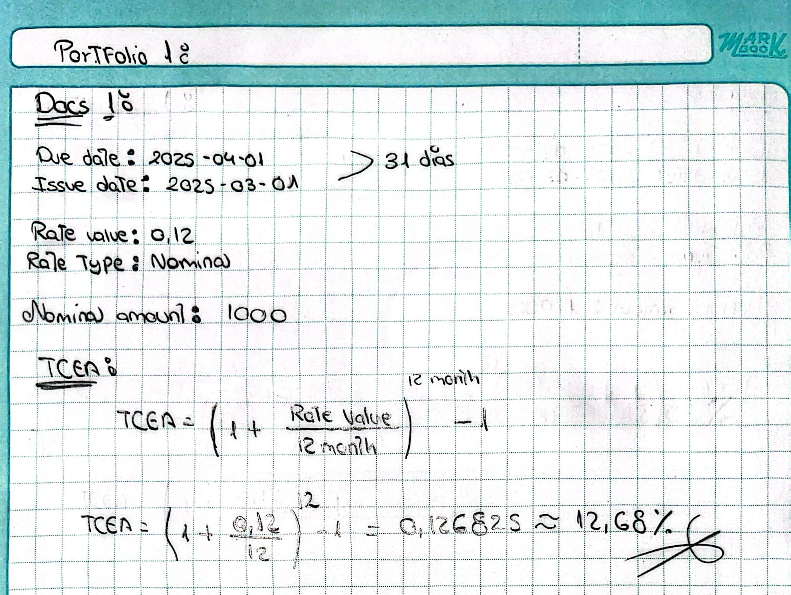
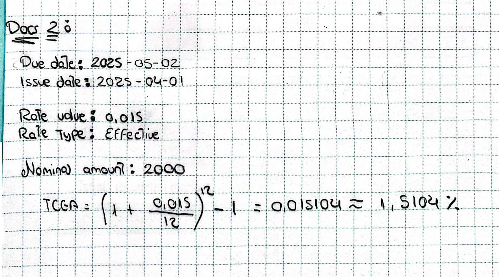
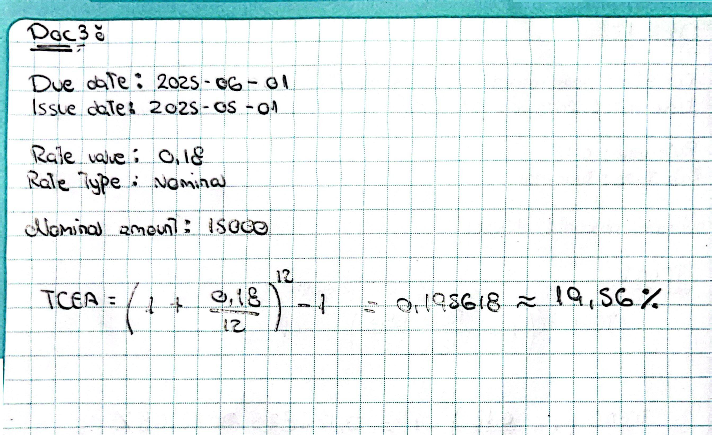
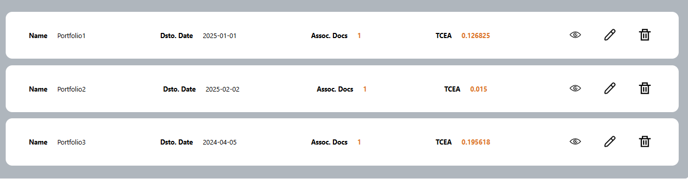

# BillSave

  <h1>Documentación de BillSave</h1>
  

  

    <h4 style="text-align: center; margin-bottom: 1.2rem;">Startup: FinWorkTech</h4>
    <table border="1" style="margin: auto;">
      <thead>
        <tr>
          <td style="text-align: center;"><strong>Miembros:</strong></td>
        </tr>
      </thead>
      <tbody>
        <tr>
          <td>Gonzalo Andre Quedena</td>
        </tr>
        <tr>
          <td>Dary Jarod Guevara Rojas</td>
        </tr>
        <tr>
          <td>Mirian Emilia Miranda Ccora</td>
        </tr>
        <tr>
          <td>Daniel Jesús Muñoz Fano</td>
        </tr>
        <tr>
          <td>Romina Alejandra Tuesta Marin</td>
        </tr>
      </tbody>
    </table>
    <h5 style="text-align: center; margin-top: 2rem;">2025</h5>
  

---

## Índice

- [Introducción](#introducción)  
- [Objetivo del Estudiante (Student Outcome)](#objetivo-del-estudiante-student-outcome)  
- [Definiciones generales y conceptos básicos](#definiciones-generales-y-conceptos-básicos)  
- [Marco Legal y Teórico](#marco-legal-y-teórico)  
- [Análisis y Diseño del Sistema](#análisis-y-diseño-del-sistema)  
  - [Análisis de Datos](#análisis-de-datos)  
  - [Diseño de la Interface](#diseño-de-la-interface)  
  - [Marco conceptual (fórmulas)](#marco-conceptual-fórmulas)  
  - [Diseño de Datos de prueba](#diseño-de-datos-de-prueba)  
- [Algoritmo](#algoritmo)  
- [Modelo de la Base de datos](#modelo-de-la-base-de-datos)  
- [Sistema de información](#sistema-de-información)  
- [Anexos](#anexos)  
- [Bibliografía](#bibliografía)

---

## Introducción
Descripción general del proyecto y los objetivos principales de la solución.

## Objetivo del Estudiante (Student Outcome)
El desarrollo del proyecto permitió alcanzar los siguientes resultados de aprendizaje:

**- ABET – EAC - Student Outcome 1:** Se identificaron y solucionaron problemas complejos de ingeniería financiera a través de una aplicación web que automatiza el cálculo de la TCEA, facilitando así la toma de decisiones económicas en pequeñas y medianas empresas

**- ABET – CAC - Student Outcome 1:** Se utilizaron principios de computación y matemáticas para diseñar y desarrollar algoritmos que gestionaran las tasas de interés nominales y efectivas, asegurando que los cálculos financieros fueran precisos.

**- ICACIT - Student Outcome A:** Se aplicaron habilidades matemáticas y de ingeniería en el desarrollo de modelos financieros que facilita evaluar diferentes alternativas de inversión y optimizar la gestión de cartera de descuento de letras y facturas.

**- ICACIT - Student Outcome E:** Se estudiaron problemas complejos de ingeniería financiera mediante la investigación y el uso de metodologías específicas para evaluar de manera precisa el costo de los instrumentos financieros, siempre con un enfoque basado en principios matemáticos.

**- ICACIT - Student Outcome L:** Se demostró experiencia en la gestión de ingeniería financiera y en la toma de decisiones económicas a traves del desarrollo de una aplicación que facilita el análisis de rentabilidad y costos de descuento, mejorando la eficiencia operativa de las empresas.

## Definiciones generales y conceptos básicos
Explicación de los términos y conceptos clave utilizados en el proyecto.

## Marco Legal y Teórico
- Marco normativo para el Perú.  
- Conceptos y metodologías que se aplican al caso, respaldados por referencias bibliográficas o normas legales.

## Análisis y Diseño del Sistema

### Análisis de Datos
- **Datos de Entrada**: Descripción de las constantes/variables, tipos, tamaños, formatos, valores por defecto y restricciones.  
- **Datos de Salida**: Descripción de las variables, tipos, tamaños y formatos.  
- **Datos Intermedios**: Descripción de las variables, tipos, tamaños y formatos.

### Diseño de la Interface
- Presentación de las pantallas de interacción con el sistema.  
- Uso de medios electrónicos para recibir ayuda sobre el uso del sistema.

### Marco conceptual (fórmulas)
- Presentación del modelo matemático y las fórmulas utilizadas en la aplicación, como el cálculo del Valor Recibido y la TCEA.

### Diseño de Datos de prueba
Para validar la correcta implementación del modelo desarrollado en la administración de cartera de descuento de facturas,  se han diseñado dos conjuntos de datos de prueba. Estos datos permiten comprobar la veracidad del cálculo de la Tasa de Coste Efectivo Anual (TCEA)

<ins>**Primer Juego de Datos de Prueba**<ins>

Este escenario simula una factura en dólares con una tasa nominal.

- Due date: 2025-04-01
- Issue date: 2025-03-01
- Rate value: 0.12
- Rate type: Nominal
- Nominal amount: 1000

**Cálculos esperado:**

***TCEA:*** 0.126825 = 12.68%

**Segundo Juego de Datos de Prueba**

Este escenario simula una factura en dólares con una tasa efectiva.

- Due date: 2026-05-02
- Issue date: 2026-04-01
- Rate value: 0.015
- Rate type: Effective
- Nominal amount: 2000

**Cálculo esperado:**

***TCEA:*** 0.015 = 1.5%

**Tercer Juego de Datos de Prueba**

Este escenario simula una factura en dólares con una tasa nominal.
- Due date: 2026-03-03
- Issue date: 2025-02-01
- Rate value: 0.18
- Rate type: Nominal
- Nominal amount: 15000

**Cálculo esperado:**

***TCEA:*** 0.195618 = 19.56%

## Algoritmo
- Pseudocódigo, Diagrama de Flujo o Diagrama de Nassi-Schneiderman que ilustre la solución.

## Modelo de la Base de datos

Este modelo permite gestionar usuarios con perfiles, administrar documentos financieros y agruparlos en paquetes de descuento para calcular la TCEA y manejar tasas nominales o efectivas en diferentes monedas.

**1. User**
  - id (PK): Identificador único del usuario.
  - Username: Nombre de usuario para autenticación.
  - Password: Contraseña del usuario.

    Relaciones:
    - Se relaciona con Profiles mediante User_id (1 usuario tiene 1 perfil).
    - Se relaciona con Packs, indicando que un usuario puede administrar varios paquetes.
      
**2. Profiles**
  - id (PK): Identificador único del perfil.
  - FullName: Nombre completo del usuario.
  - User_id (FK): Relación con la tabla User, lo que indica que cada usuario tiene un único perfil.

    Relaciones:
    - User (1 a 1). Un usuario tiene un perfil asociado.

**3. Documents**
  - id (PK): Identificador único del documento.
  - Code: Código del documento.
  - NominalAmount: Monto nominal de la factura o letra.
  - IssueDate: Fecha de emisión del documento.
  - DueDate: Fecha de vencimiento del documento.
  - TypeRate: Tipo de tasa (bit: 0 = Nominal, 1 = Efectiva).
  - RateValue: Valor de la tasa de interés.
  - Currency: Tipo de moneda (bit: 0 = Soles, 1 = Dólares).
  - portfolio_id: Relacionado con portafolios.

    Relaciones:
    - Se relaciona con Packs, indicando que un paquete de descuento puede agrupar varios documentos.
  
**4. Packs**
  - id (PK): Identificador único del paquete.
  - Name: Nombre del paquete.
  - DiscountDate: Fecha en la que se aplica el descuento.
  - TotalDocuments: Número total de documentos en el paquete.
  - EffectiveAnnualCostR: Tasa de Costo Efectivo Anual (TCEA).
  - User_id (FK): Relación con User, indicando quién creó el paquete.
  - Documents_id (FK): Relación con Documents, indicando qué documentos están en el paquete.
  
    Relaciones:
    - Relacionado con User, indicando que cada usuario puede administrar varios paquetes de descuento.
    - Relacionado con Documents, ya que un paquete de descuento puede contener varios documentos financieros.

## Sistema de información
- Implementación del análisis y diseño del sistema utilizando un lenguaje de programación orientado al desarrollo web o móvil.  
- Requisitos:  
  a) Conectividad.  
  b) Base de datos.  
  c) Código fuente.  
  d) Ayuda y asistencia técnica.  
  e) Validación y pruebas.

## Anexos
- Presentación de alto impacto académico/comercial de la aplicación, encartes, brochures informativos u otros materiales relacionados con la aplicación.

## Bibliografía

Markdown. (s/f). *Basic Syntax*. Recuperado el 2 de marzo de 2025, de (https://www.markdownguide.org/basic-syntax/)
